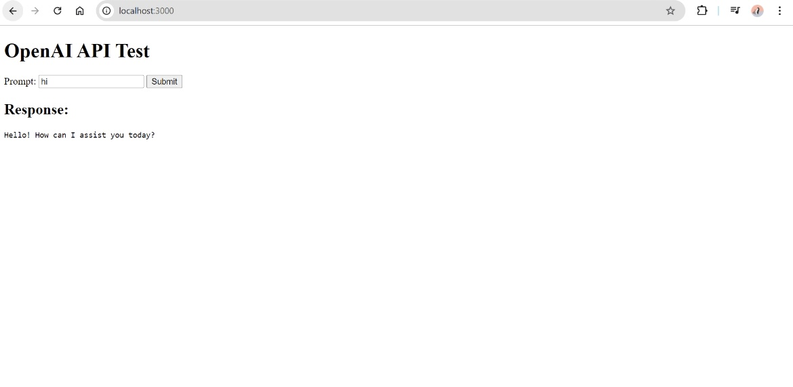
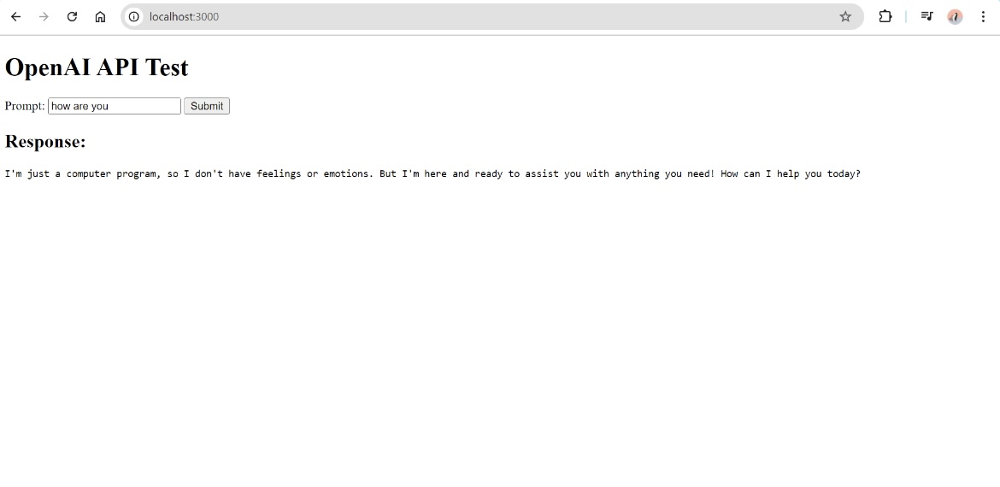

# openai-chatbot-nodejs

## Introduction
This project demonstrates how to integrate Node.js with the OpenAI API to create a simple chatbot that takes user input and displays the response. The project aims to provide an interactive user interface for querying the OpenAI API.

## Prerequisites
Before you begin, ensure you have the following installed:
- Node.js
- npm (Node package manager)
- A valid OpenAI API key

## Steps to Implement

### 1. Obtain OpenAI API Key
Visit the OpenAI API website and sign up for an account.
Generate an API key from the API settings page.

### 2. Setup Node.js Project
Initialize a new Node.js project using npm init and install the necessary packages:

```bash
npm install express axios dotenv
```
### 3. Coding in VS Code
Open VS Code and navigate to the project directory.
Create a server.js file to set up the basic server using Express.js.
Use Axios to integrate the OpenAI API and handle user input.

### 4. HTML and JavaScript
In the public/ folder, create an index.html file to build the user interface.
Write the necessary JavaScript in script.js to send user input to the server and display the response.

### 5. Running the Server
Start the server using the following command:

```bash
node server.js
```
### Example Output
Here are two example outputs demonstrating the interaction with the chatbot:

 

 
